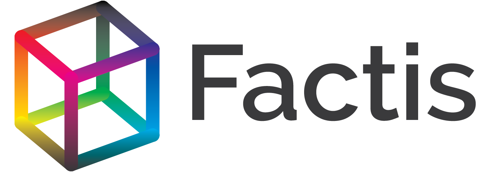

The modular database system. Available on NPM as [factis](https://www.npmjs.com/package/factis).

# Presentation

Factis is a modular datastore written in pure javascript (native C datastore coming). Factis is similar to RDF datastores, and in particular Hexastore implementations.

The [factis](https://www.npmjs.com/package/factis) package is a ready-to-use version of the whole Factis ecosystem.

Factis is made of a core module [factis-core](https://www.npmjs.com/package/factis-core) which contains the query API and the query engine.

Then different datastore modules called factis-store-something can be plugged in, in order to provide different functionalities. The datastore modules comply to a simple triple store interface. Available modules are:

  - [factis-store-group](https://www.npmjs.com/package/factis-store-group) the basic store that allow to group several stores, providing the composition semantics.
  - [factis-store-hexastore](https://www.npmjs.com/package/factis-store-hexastore) an efficient hexastore implementation in pure JS with no dependencies
  - [factis-store-identity](https://www.npmjs.com/package/factis-store-identity) which provides the semantics for the `equals` and `not equals` predicates
  - Some more to come ! (Dates, Geometry, JSON...)

# Install

With Node package manager:

~~~{.bash}
npm install factis
~~~

# Usage

Here is a small example:

~~~{.javascript}
var Factis=require('factis');

var f = new Factis();

f.add([
  f.fact("Factis","is","nice"),
  f.fact("Factis","is","fast")
  ]);

f.query(f.fact(f.the("Thing"),"is","nice"));
~~~

# Documentation

Factis is basically an augmented triple store. [CRUD](https://en.wikipedia.org/wiki/Create,_read,_update_and_delete) operations are implemented by using only three operations: Add, Remove, Query.

## Add and Remove

Add and remove single facts, or triples:

~~~{.javascript}
f.add(    f.fact("subject","predicate","object") );
f.remove( f.fact("subject","predicate","object") );
~~~

Add and remove multiple facts, or triples:

~~~{.javascript}
f.add([
   f.fact("s1","p1","o1")
   f.fact("s2","p2","o2")
])
f.remove([
   f.fact("s1","p1","o1")
   f.fact("s2","p2","o2")
])
~~~

## Import and Export

Add and remove single facts by accessing the underlying hexastore:

~~~{.javascript}
var myExportString = f.hexastore.exportString();
f.hexastore.importString(myExportString);
~~~

## Query

Query operators are first order logic operators:

~~~{.javascript}
var query =
  f.and(
    f.fact( f.the("thing") , "is" , "nice" ),
    f.fact( f.the("thing") , "is" , "fast" ),
    f.not(
      f.fact( f.the("thing") , "is" , "bad" )
      )
    );
~~~

To perform a query:

~~~{.javascript}
var result =
  f.query( query );
~~~

Query returns an array of maps which give values to the query variables:

~~~{.javascript}
result == [
  { Thing : "Factis" }
  ]
~~~

If the query result is infinite, the query returns `null`

## Develop additional stores

Check the sources of [factis-store-group](https://github.com/Factisio/factis-store-group) on Github to see an example of the structure of a basic module.

Factis stores must have a name which start with factis-store-

These packages must exhibit 8 different functions that return sets of triples  that match a query.
These functions represents the 8 possible combinations of Subject, Predicate and Object presence:

  - `queryXXX` which should return **all** the triples that the store is aware of.
  - `queryXXO` which should return the triples that have a given Object
  - `queryXPX` which should return the triples that have a given Predicate
  - `queryXPO` which should return the triples that have given Predicate and Object
  - `querySXX` which should return the triples that have a given Subject
  - `querySXO` which should return the triples that have given Subject and Object
  - `querySPX` which should return the triples that have given Subject and Predicate
  - `querySPO` which should return the **only** triple that have given Subject, Predicate and Object

These functions return the following values:

  - If the set of triples is infinite, then the store should return `null`
  - If the set of triples is empty, the store should return the empty array `[]`
  - If the set of triples is finite, the store should return it as an array `[['s1','p1','o1'],['s2','p2','o2'],...]`
